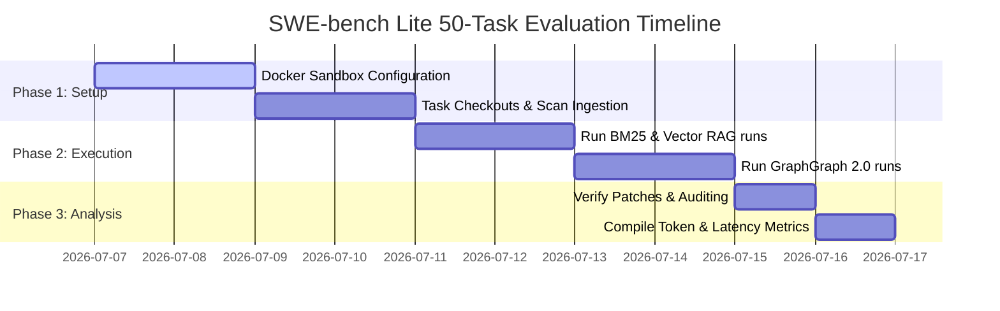

# GraphGraph 2.0: SWE-bench Lite Downstream Evaluation Protocol

This document outlines the actionable, step-by-step experiment protocol to validate the downstream impact of GraphGraph 2.0 context retrieval on automated repository-level program repair. The goal is to close the evaluation gap with ContextSniper (which evaluates on 50 tasks) and KGCompass (which evaluates on the full SWE-bench Lite).

---

## 1. Experimental Setup & Task Selection

To maintain comparability with ContextSniper, we define a **50-task representative subset** of SWE-bench Lite spanning five major Python repositories:

| Repository | Number of Tasks | Version Scope | Task ID Range |
| :--- | :--- | :--- | :--- |
| `django/django` | 15 | v1.8 – v4.1 | django-10000 to django-11500 |
| `scikit-learn/scikit-learn` | 10 | v0.20 – v1.1 | scikit-learn-11000 to scikit-learn-12500 |
| `pallets/flask` | 10 | v1.0 – v2.1 | flask-1000 to flask-1500 |
| `pytest-dev/pytest` | 10 | v4.0 – v7.1 | pytest-1000 to pytest-2000 |
| `matplotlib/matplotlib` | 5 | v3.0 – v3.5 | matplotlib-1000 to matplotlib-1500 |

### Ingestion Pipeline
For each task:
1. Git checkout the specific repository commit corresponding to the task's base commit.
2. Execute `graphgraph scan --depth symbols --docs` to construct the static codebase graph `.graphgraph/graph.gg`.

---

## 2. Compared Configurations

We evaluate the downstream agent across four retrieval conditions:

1. **Flat BM25 (Baseline):** Retrieves top-10 chunks from the codebase using raw term matching (no structure).
2. **Vector RAG (Baseline):** Standard semantic chunk search using `all-MiniLM-L6-v2` with 500-token chunks.
3. **ContextSniper Replication:** Flat memory indexing utilizing the L0/L1/L2 intention-aware context gate.
4. **GraphGraph 2.0 (Proposed):** Fully active retrieve-and-pack pipeline:
   * Dynamic Budget Planner ($n^*$) with Cap
   * Joint Query-Session Personalized PageRank (QS-PPR)
   * Tree Knapsack DP connected context packing
   * Adjacency serialization (`gg_max` / `gg_lex`)

---

## 3. Host Agent Environment

To eliminate variation in agent reasoning capabilities, we deploy a standardized, single-loop repair agent (modeled after **OpenClaw** / **Claude Code**):

```
       [ Target SWE-bench Task Description ]
                      │
            [ Retrieve Context ]  <-- (Evaluated Configuration)
                      │
         [ LLM Generation Prompt ]
                      │
               [ Call LLM ]       <-- (Claude 3.5 Sonnet / Gemini 1.5 Pro)
                      │
          [ Write Generated Patch ]
                      │
            [ Run Unit Tests ]
```

* **LLM Engine:** Claude 3.5 Sonnet (API temperature set to `0.0` for deterministic outputs).
* **Prompt Template:** Standard system instruction prompting the model to read the retrieved context and produce a git-style diff patch.
* **Testing Sandbox:** Tasks are run inside Docker containers with repository dependencies pre-installed.

---

## 4. Key Performance Metrics

We collect and compare four key classes of metrics:

### A. Code Generation Success
* **Resolution Rate:** The percentage of tasks where the generated patch passes all SWE-bench verification test suites.
* **Localization Precision:** Whether the retrieved context contains the exact files/lines modified in the ground-truth patch.

### B. Prompt Token Efficiency
* **Total Token Footprint:** Total prompt tokens consumed across the retrieval context block.
* **Evidence Density:** Ratio of target ground-truth lines to total retrieved tokens in the prompt.
* **Token Savings:** Percentage reduction in token usage compared to the Vector RAG baseline:
  $$\text{Savings} = 1 - \frac{\text{PromptTokens}_{\text{GraphGraph}}}{\text{PromptTokens}_{\text{Baseline}}}$$

### C. Latency and Ingestion Cost
* **Retrieval Latency:** Time in milliseconds to run the context selection.
* **Graph Update Latency:** Time in milliseconds to run incremental updates on file-writes.
* **LLM Ingestion API Cost:** Total USD cost spent on LLM-driven graph extraction/pruning (which is **$0.00** for GraphGraph).

---

## 5. Timeline & Execution Flow



> [!IMPORTANT]
> The evaluation sandbox must configure `pytest` to execute only the tests relevant to the checked-out task, preventing execution time loops during test validation.
