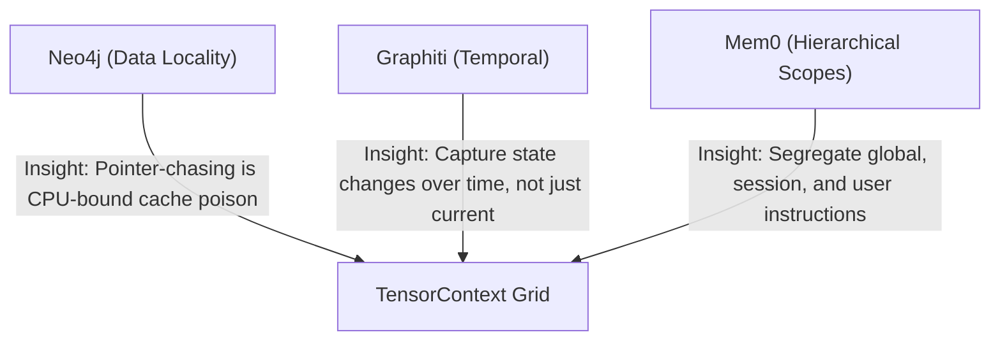

# Blueprint: GraphGraph 2.0 / TensorContext

This architectural blueprint synthesizes the core insights of **Neo4j** (data locality), **Graphiti** (temporal invalidation), and **Mem0** (scoped hierarchical memory) into a unified, next-generation engine designed specifically for developer tools and AI coding assistants: **TensorContext**.

---

## 1. Synthesis of Core Insights



1. **From Neo4j (Memory Locality)**: We discard pointer-chasing linked records in favor of a **contiguous CSR (Compressed Sparse Row) matrix block**.
2. **From Graphiti (Temporal Invalidation)**: Instead of costly LLM-driven updates, we track file states via **deterministic Git diffs** and **LSP (Language Server Protocol) analysis**.
3. **From Mem0 (Scoped Memory)**: We unify global code symbols, ephemeral editor sessions, and persistent instruction files into a single, cohesive graph database.

---

## 2. Unified Multi-Tier Graph Architecture

Instead of three disconnected systems, **TensorContext** structures the codebase context into three interconnected topological layers:

```
  [ User Instruction Layer ]   <-- (Rules, CLAUDE.md, Project Conventions)
             |  (applies_to)
  [ Ephemeral Session Layer ]  <-- (Active Tabs, Cursor position, Git Diff, Lints)
             |  (currently_editing / edits)
  [ Deterministic AST Layer ]  <-- (Static Class, Function, File Call Graph)
```

1. **The Static AST Layer (Global)**: High-resolution call graphs and symbol declarations extracted via Tree-sitter.
2. **The Ephemeral Session Layer (Temporal)**: Dynamic nodes capturing active file tabs, cursor hotspots, current compiler warnings, and git changes.
3. **The User Instruction Layer (Persistent)**: Guidelines and rules mined from `.cursorrules`, `AGENTS.md`, and custom instructions.

### Grounded Ontological Linking
These layers are bound together via explicit temporal edges:
* `(SessionNode) -[currently_editing]-> (CodeSymbol)`
* `(UserRuleNode) -[applies_to]-> (CodeSymbol / Subsystem)`
* `(GitDiffNode) -[modifies]-> (CodeSymbol)`

---

## 3. VRAM-Native Layout & GPU Attention Masking

Instead of serializing the graph as text for the LLM to read and parse, **TensorContext compiles the retrieved sub-graph directly into tensor layouts** that can be injected into the transformer model's self-attention layers:

### The Adjacency & Spatial Bias Tensors
For a retrieved context subgraph of $N$ nodes, we compile:
1. **Adjacency Tensor ($A \in \mathbb{R}^{N \times N}$)**: Binary adjacency representing direct code call/import relationships.
2. **Spatial Bias Tensor ($S \in \mathbb{R}^{N \times N}$)**: Geodesic path distances between nodes, used to scale attention.
3. **Semantic Embedding Matrix ($V \in \mathbb{R}^{N \times D}$)**: Compact $D$-dimensional node summary embeddings.

### GPU Attention Mask Integration
During model inference, we inject the Spatial Bias Tensor $S$ directly into the transformer's attention head calculation:

$$\text{Attention}(Q, K, V) = \text{Softmax}\left(\frac{QK^T}{\sqrt{d_k}} + S\right)V$$

* **Why this is better**: The model does not need to read text lists of dependencies or chase pointers; the spatial layout of the codebase is hardcoded directly into the attention mask. The self-attention heads resolve code pathways in parallel on the GPU.

---

## 4. Zero-LLM-Cost Temporal Update Engine

Unlike Graphiti or Mem0, which run expensive LLM prompts to update conversational memories, TensorContext updates its state deterministically using local system hooks:

### A. Git & File Watcher Updates (Incremental Compiler)
* File saves trigger a local AST re-scan only on dirty files.
* Modified symbols update in-place in the `.gg` CSR block.
* Deleted symbols prune adjacent edges instantly using direct array pointer adjustments.

### B. Keystroke-Decayed Session Weights
Active session nodes (e.g., how relevant a file is to the current task) are updated via a mathematical half-life decay function based on elapsed time and user keystrokes:

$$W(t) = W_0 \cdot 2^{-\frac{\Delta t}{\lambda}}$$

* **$\Delta t$**: Time elapsed or keystroke count since the developer last edited/viewed the file.
* **$\lambda$**: Decaying half-life constant.
* Stale session context naturally fades out of the active retrieval window without requiring LLM invalidation prompts.
